## Elección de escenario con mejor resultado de convergencia

### PVST

La convergencia para este protocolo se realizó de la siguiente manera:

#### Red Primaria

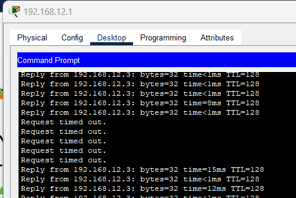

Se comenzó a hacer ping desde la PC 192.168.12.1 a la PC 192.168.12.3, se procedió a apagar el enlace que permitía la comunicación entre estas dos vlans y se observó que el tiempo de convergencia fue de 35 segundos.

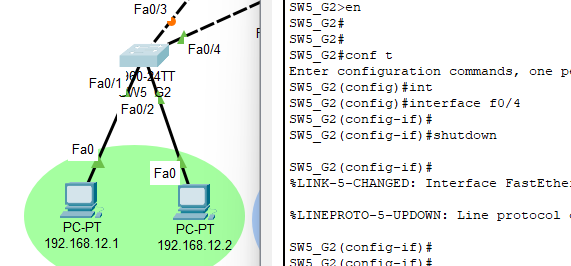

#### Red Básicos

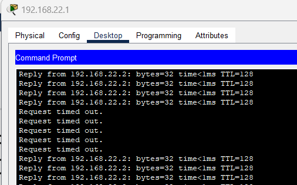

Se realizó el mismo procedimiento que en la red primaria, los pings fueron desde 192.168.22.1 hacia 192.168.22.2, se apagó el enlace que permitía la comunicación entre estas dos vlans y se observó que el tiempo de convergencia fue de 34 segundos.

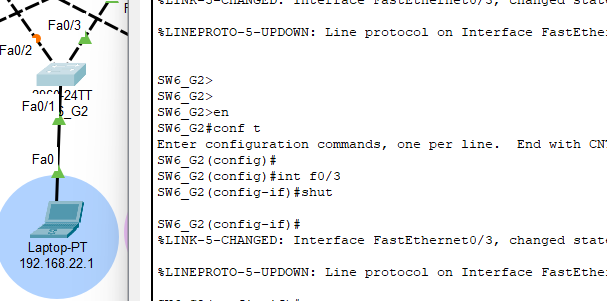

#### Red Diversificado

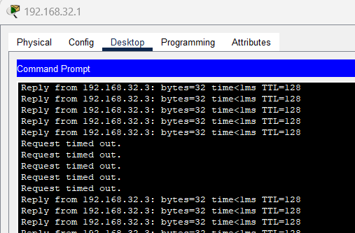

Al igual que en la medición de convergencias anteriores, los pings fueron desde 192.168.32.1 hacia 192.168.32.3, se apagó el enlace que permitía la comunicación entre estas dos vlans y se observó que el tiempo de convergencia fue de 33.20 segundos.

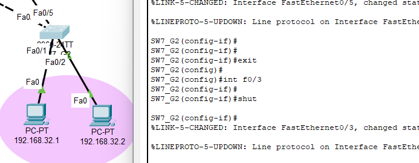

### Rapid PVST

Rapid PVST es un protocolo que permite la convergencia de la red de manera más rápida que PVST, esto se debe a que se implementa el protocolo RSTP en cada vlan, por lo que se tiene un árbol de expansión por cada vlan.

Para hacer uso de este modo se configuró en todos los switch lo siguiente:

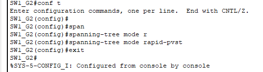

Lo cual es la configuración para que los switches utilicen el protocolo Rapid PVST en lugar de PVST.

Para todas las redes se realizó el mismo procedimiento que en PVST, se utilizaron los mismos hosts y se apagaron los mismos enlaces, los resultados fueron los siguientes:

#### Red Primaria

Se hizo un ping extendido desde la PC 192.168.12.1 hacia la PC 192.168.12.3.
La convergencia fue inmediata, no se perdió ningún paquete.

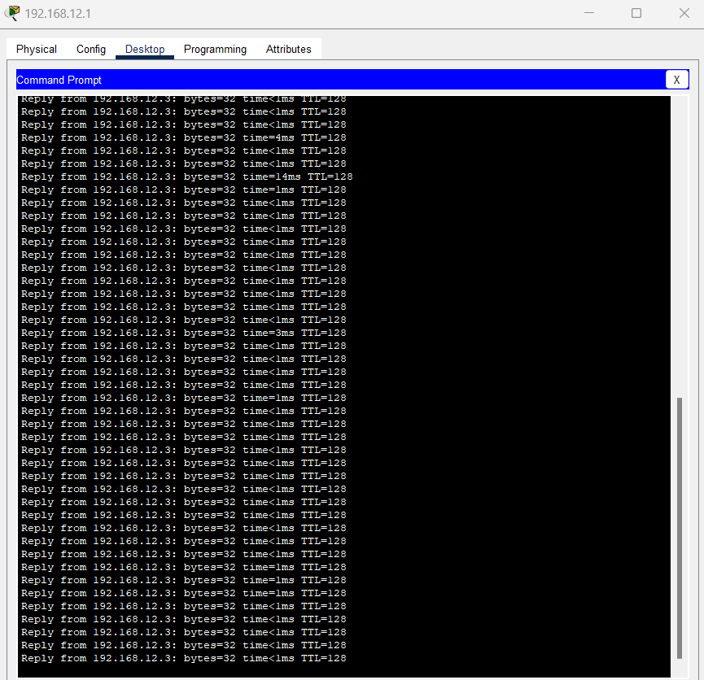

#### Red Básicos

Se hizo un ping extendido desde la PC 192.168.22.1 hacia la PC 192.168.22.2.
La convergencia fue inmediata, no se perdió ningún paquete.

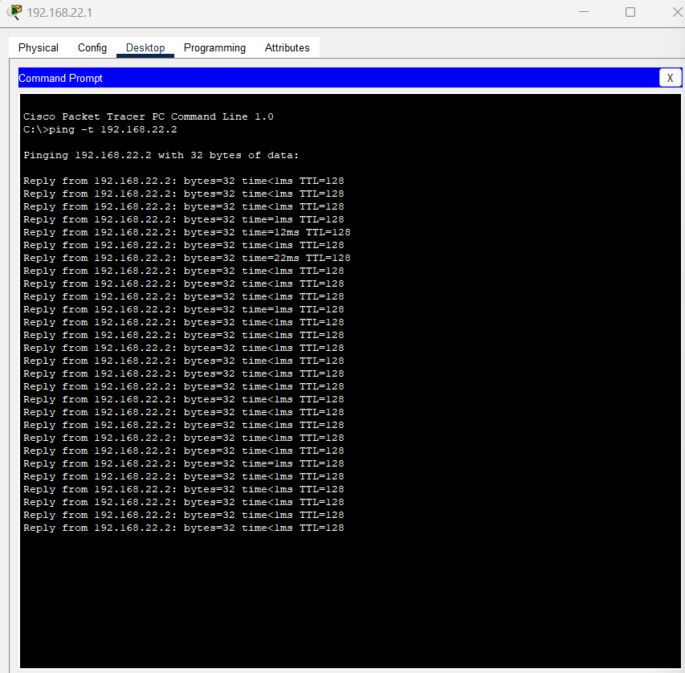

#### Red Diversificado

Se hizo un ping extendido desde la PC 192.168.32.1 hacia la PC 192.168.32.3.
La convergencia fue inmediata, no se perdió ningún paquete.

Algo que se observó en esta red es que al momento de activar el enlace que se había apagado, se perdió un paquete.

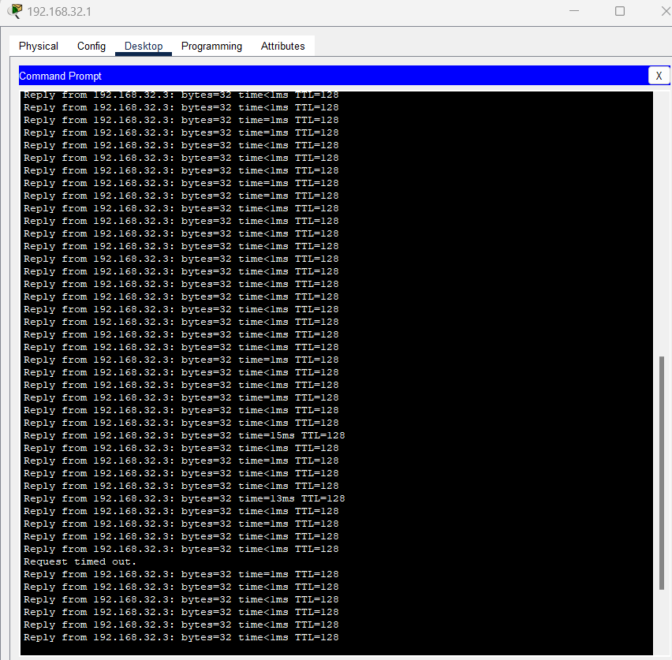

| Escenario | Protocolo Spanning-Tree | Red Primaria | Red Básicos | Red Diversificado |
| --------- | ----------------------- | ------------ | ----------- | ----------------- |
| 1         | PVST                    | 35s          | 34s         | 33.20s            |
| 2         | Rapid PVST              | 0s           | 0s          | 0s                |

### Elección de escenario

Se eligió el escenario 2, ya que la convergencia es inmediata, no se pierden paquetes y se tiene un árbol de expansión por cada vlan, lo cual permite que la red sea más eficiente. Por lo que tomando como referencia un caso de la vida real, el protocolo Rapid PVST es el más adecuado para la mayoría de las redes y en este caso, para la red que se está trabajando.

## Políticas de puerto compartidas

### Activar el port-security en todos los puertos de acceso

El port-security es una característica que permite limitar el número de direcciones MAC que se pueden aprender en un puerto de acceso, esto con el fin de evitar ataques de tipo MAC flooding.

Para activar el port-security en todos los puertos de acceso se ingresó a la interfaz fastEthernet del enlace que conecta al host y se configuró lo siguiente:

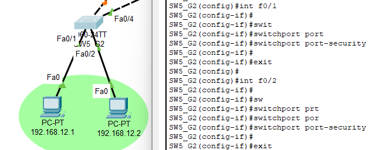

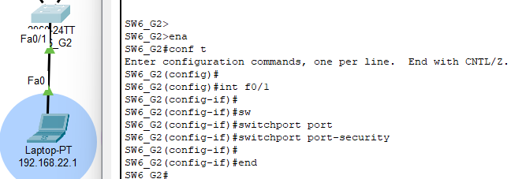

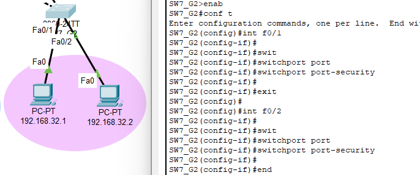

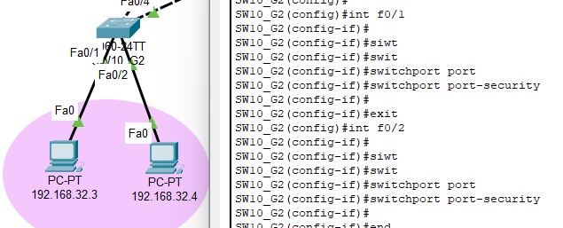

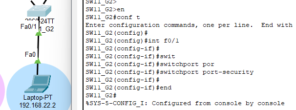

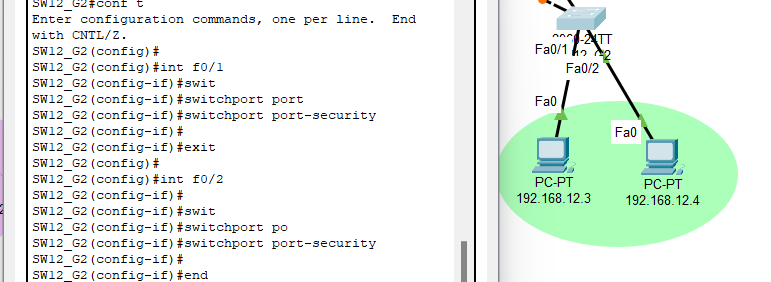

Cada imagen anterior corresponde a la configuración de cada switch que tiene un enlace hacia un host. En este caso se configuró el port-security para que solo se aprenda una dirección MAC en cada puerto de acceso.
