# Manual técnico | Práctica 1 

## Integrantes Grupo 2

| Carnet    | Nombre                        |
| --------- | ----------------------------- |
| 201800476 | Marvin Alexis Estrada Florian |
| 201902781 | Rodrigo Antonio Porón De León |

## Topología implementada

Se utilizó la herramienta Packet Tracer para la implementación de la topología solicitada, constando de 12 switches y 10 PC-PT, cada switch configurado con sus respectivos puertos truncales y de acceso como se detallará más adelante:

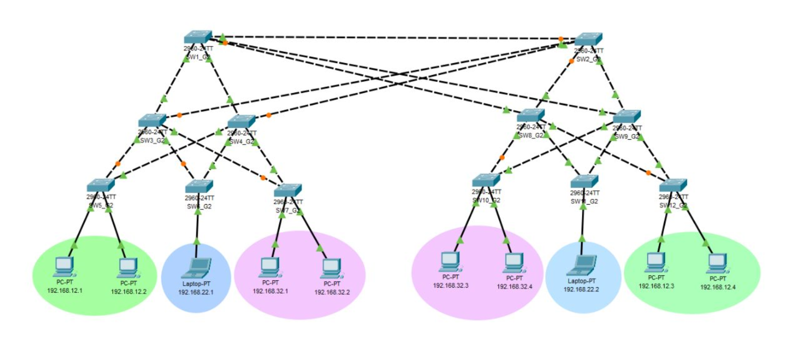

## Configuración de Ip

Cada PC-PT posee una ip determinada con la siguientes direcciones de red:

| Red           | Dirección       |
| ------------- | --------------- |
| Primaria      | 192.168.12.0/24 |
| Básicos       | 192.168.22.0/24 |
| Diversificado | 192.168.32.0/24 |

Por lo que se procede a configurar la respectiva Ip sobre estas, donde a continuación se muestra un ejemplo de este proceso sobre cada red solicitada:

- Primaria

  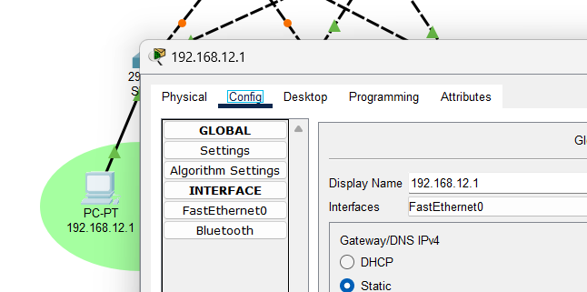

- Básicos

  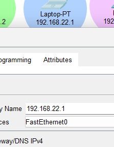

- Diversificado

  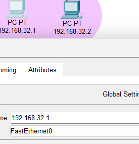

## Hostname y Contraseña en Switches

Como se muestra en la siguiente imagen, se tiene el comando HOST, el cual procede a cambiarle la etiqueta o nombre a un switch, esto aplicado sobre todos los switches de toda la topología:
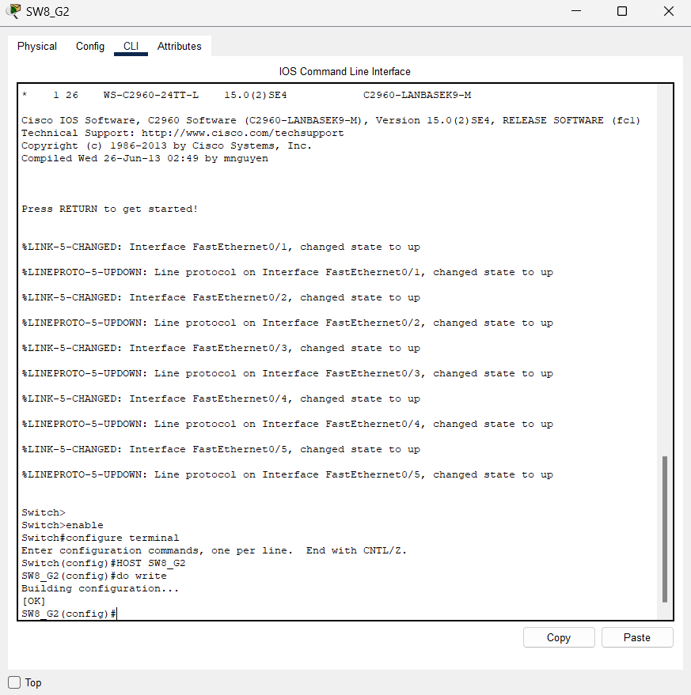

Se procedió a la colocación de contraseña encriptada, esto únicamente aplicado sobre el server switch SW1_G2, de la siguiente manera:

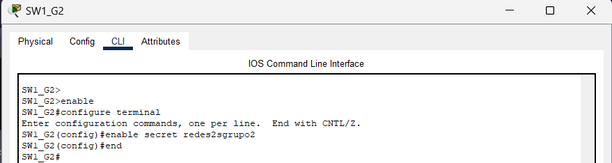

Por lo que para una correcta verificación de una contraseña encriptada, se observa el siguiente comando para observarla:

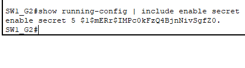

## Configuración de VTP

### VLAN

Para realizar esta configuración, se seleccionó al switch SW1_G2 para ser el servidor VTP, por lo que a continuación se muestra su proceso, donde se agrega el dominio g2 y contraseña usac, para luego agregarle las VLAN's solicitadas:

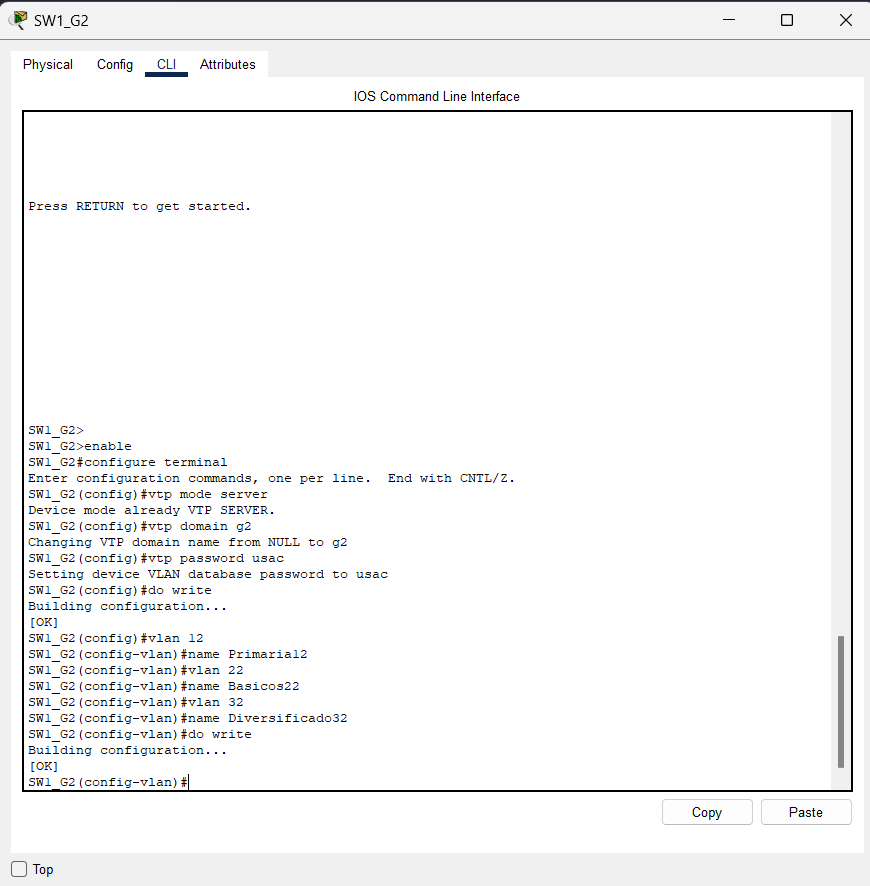

Posteriormente, así como se configuró el switch server, se procedió a configurar todos los demás switches como clientes, de la siguiente forma:

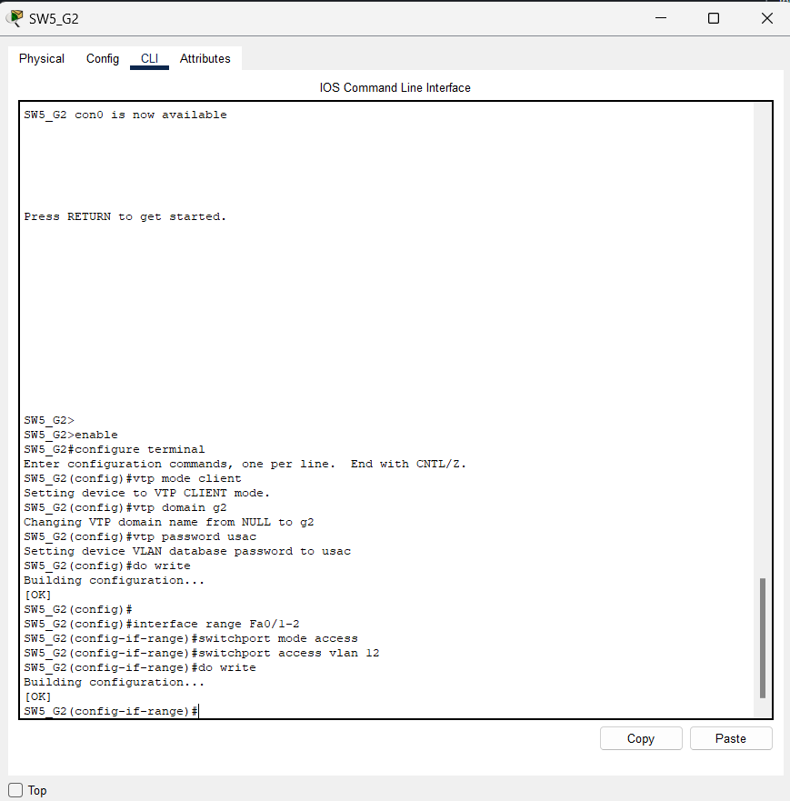

Para aceptar el tráfico de paquetes de las VLAN's, se procedió a la colocación de las respectivas interfaces en modo truncal, esta configuración se aplicó a todos los switches que no tenían contacto directo con un dispositivo final:

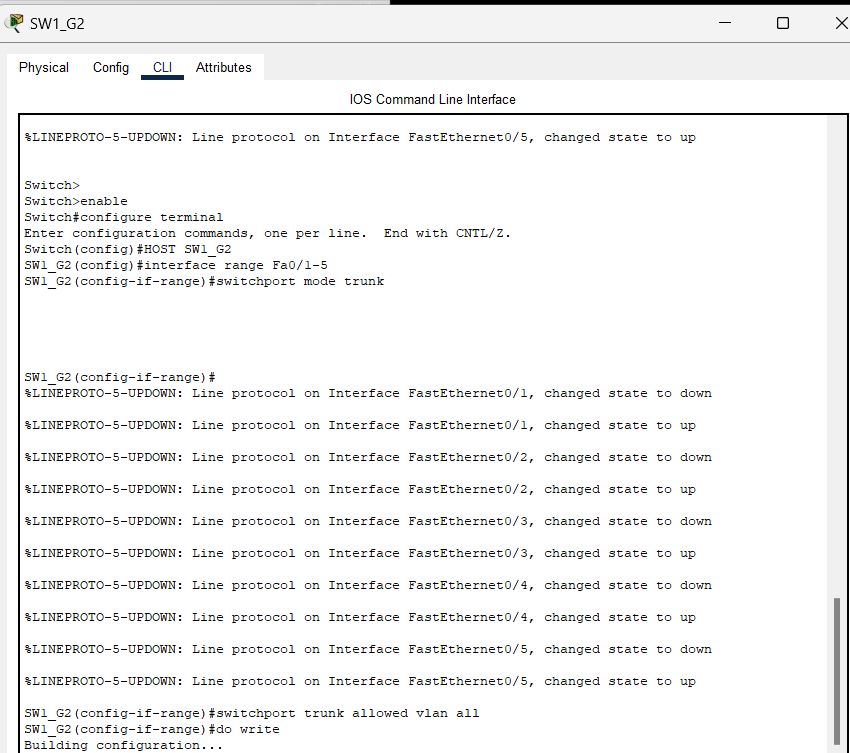

Esta configuración, al contrario del truncal, se utilizó para únicamente dejar pasar los paquetes según correspondía la vlan, por lo que en la imagen que se muestra a continuación se tiene la implementación de las interfaces en modo acceso, con contacto directo a dispositivos finales:

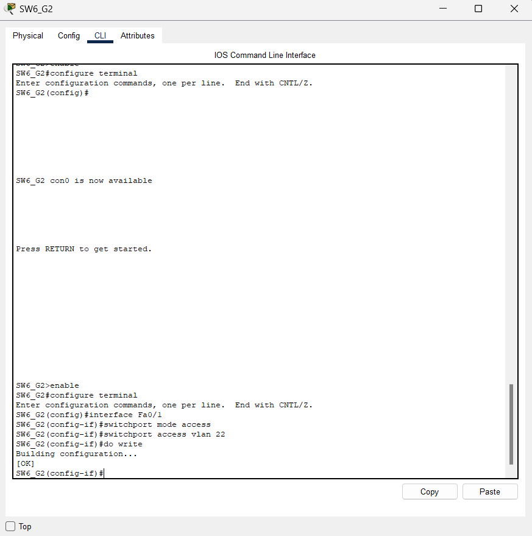

Por último, se tiene la prueba de envío de ping entre redes, enviandose desde 192.168.12.1 a
192.168.12.3 y 192.168.12.4, las cuales si pertenecen a su VLAN, pero 192.168.22.1 al no pertenecer a la misma, rechaza los paquetes correctamente:

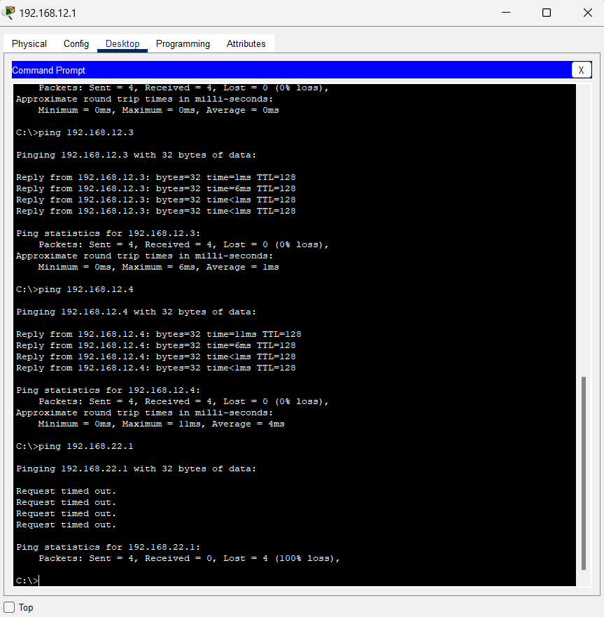

## Elección de escenario con mejor resultado de convergencia

### PVST

La convergencia para este protocolo se realizó de la siguiente manera:

#### Red Primaria

Se comenzó a hacer un ping extendido desde la PC 192.168.12.1 a la PC 192.168.12.3, se procedió a apagar el enlace que permitía la comunicación entre estas dos vlans y se observó que el tiempo de convergencia fue de 35 segundos.

#### Red Básicos

Se realizó el mismo procedimiento que en la red primaria, se hizo un ping extendido desde la PC 192.168.22.1 hacia la PC 192.168.22.2, se apagó el enlace que permitía la comunicación entre estas dos vlans y se observó que el tiempo de convergencia fue de 34 segundos.

#### Red Diversificado

Al igual que en la medición de convergencias anteriores, se hizo un ping extendido desde la PC 192.168.32.1 hacia la PC 192.168.32.3, se apagó el enlace que permitía la comunicación entre estas dos vlans y se observó que el tiempo de convergencia fue de 33.20 segundos.

### Rapid PVST

Rapid PVST es un protocolo que permite la convergencia de la red de manera más rápida que PVST, esto se debe a que se implementa el protocolo RSTP en cada vlan, por lo que se tiene un árbol de expansión por cada vlan.

Para hacer uso de este modo se configuró en todos los switch lo siguiente:

Lo cual es la configuración para que los switches utilicen el protocolo Rapid PVST en lugar de PVST.

Para todas las redes se realizó el mismo procedimiento que en PVST, se utilizaron los mismos hosts y se apagaron los mismos enlaces, los resultados fueron los siguientes:

#### Red Primaria

Se hizo un ping extendido desde la PC 192.168.12.1 hacia la PC 192.168.12.3.
La convergencia fue inmediata, no se perdió ningún paquete.

#### Red Básicos

Se hizo un ping extendido desde la PC 192.168.22.1 hacia la PC 192.168.22.2.
La convergencia fue inmediata, no se perdió ningún paquete.

#### Red Diversificado

Se hizo un ping extendido desde la PC 192.168.32.1 hacia la PC 192.168.32.3.
La convergencia fue inmediata, no se perdió ningún paquete.

Algo que se observó en esta red es que al momento de activar el enlace que se había apagado, se perdió un paquete.

| Escenario | Protocolo Spanning-Tree | Red Primaria | Red Básicos | Red Diversificado |
| --------- | ----------------------- | ------------ | ----------- | ----------------- |
| 1         | PVST                    | 35s          | 34s         | 33.20s            |
| 2         | Rapid PVST              | 0s           | 0s          | 0s                |

### Elección de escenario

Se eligió el escenario 2, ya que la convergencia es inmediata, no se pierden paquetes y se tiene un árbol de expansión por cada vlan, lo cual permite que la red sea más eficiente. Por lo que tomando como referencia un caso de la vida real, el protocolo Rapid PVST es el más adecuado para la mayoría de las redes y en este caso, para la red que se está trabajando.

## Políticas de puerto compartidas

### Activar el port-security en todos los puertos de acceso

El port-security es una característica que permite limitar el número de direcciones MAC que se pueden aprender en un puerto de acceso, esto con el fin de evitar ataques de tipo MAC flooding.

Para activar el port-security en todos los puertos de acceso se ingresó a la interfaz fastEthernet del enlace que conecta al host y se configuró lo siguiente:

Cada imagen anterior corresponde a la configuración de cada switch que tiene un enlace hacia un host. En este caso se configuró el port-security para que solo se aprenda una dirección MAC en cada puerto de acceso.

### Configuración de port-security con mac-address en todos los puertos de acceso

A continuación se muestra la configuración de la mac-address permitida para cada puerto con modo acceso, ingresando la correspondiente a cada PC-PT conectada a su respectiva interfaz de cada switch:

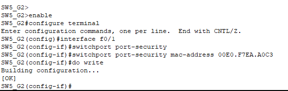

Por lo que se procedió a realizar la conexión de otra PC-PT de la misma VLAN para la comprobación del funcionamiento del security-port, por lo que al hacer ping de 192.168.12.4 a 192.168.12.2 las solicitudes son bloqueadas y el puerto procede a apagarse:

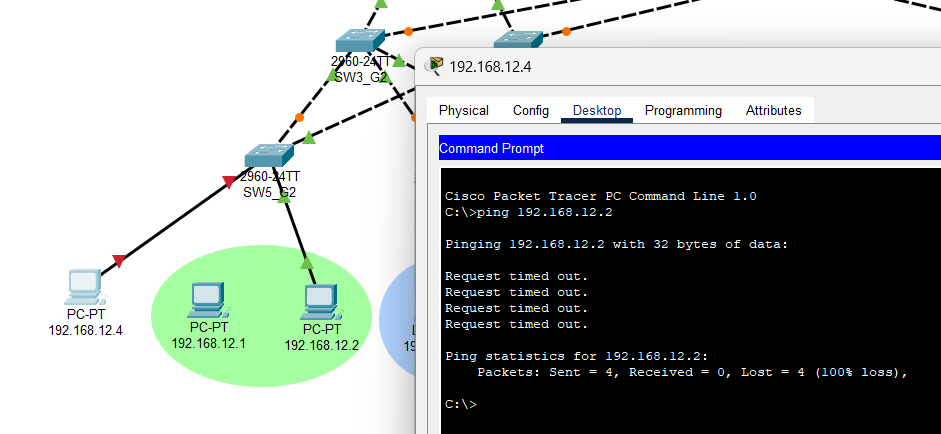

Luego se procedió a reconectar la PC-PT correspondiente y volviendo a encender el puerto del switch, el cual se apagó por el procedimiento anterior de la siguiente forma:

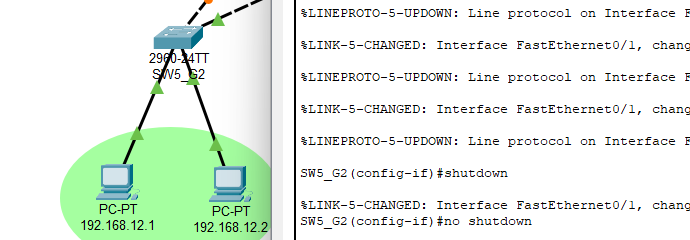

En el caso de tener un switch con dos interfaces, se muestra el detalle de como se configuró en su totalidad el switch con port-security, cada una con su respectiva mac-address de su PC-PT correspondiente, de la siguiente manera:

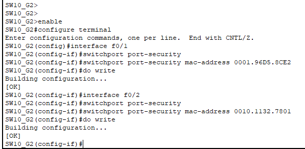

Se muestra un ejemplo en la red de Básicos, conectando diferentes PC-PT a cada switch, observando que los puertos se apagan y no envían los paquetes de ping:

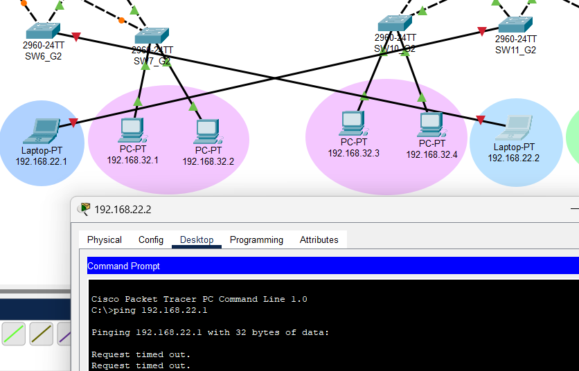

Por último se tiene otro ejemplo de la red de Diversificado, conectando las mismas PC-PT en su switch pero invirtiendo el puerto conectado, observando que los puertos se apagan y no envían los paquetes de ping:

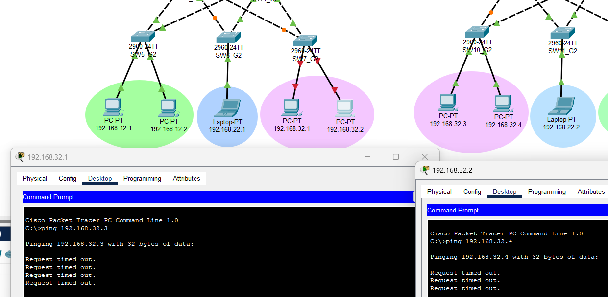

###### _2023 - Laboratorio de Redes de computadoras 2_

---
