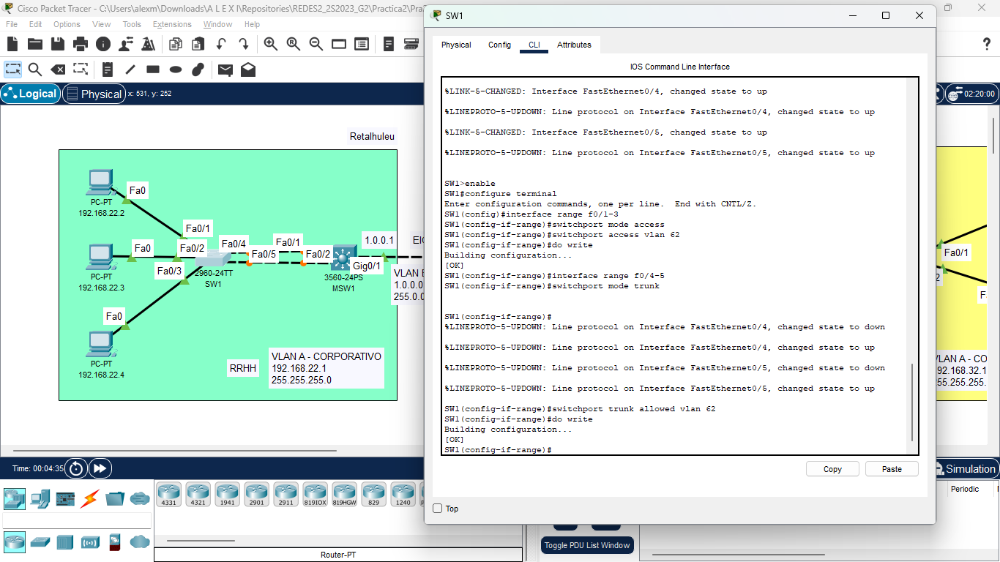

# Manual técnico | Práctica 2 

## Integrantes Grupo 2

| Carnet    | Nombre                        |
| --------- | ----------------------------- |
| 201800476 | Marvin Alexis Estrada Florian |
| 201902781 | Rodrigo Antonio Porón De León |

## Topología implementada

Se utilizó la herramienta Packet Tracer para la implementación de la topología solicitada, constando de 2 switches de capa 3 y 3 de capa 2, utilizando 6 PC-PT, cada switch configurado con sus respectivos puertos truncales y de acceso como se detallará más adelante:

## Configuración de Ip

Existen 5 redes dentro de la topología con una ip determinada con la siguientes direcciones en la tabla:

| Red           | Dirección       | Máscara de subred |
| ------------- | --------------- | ----------------- |
|     RRHH      |   192.168.22.0  |   255.255.255.0   |
|    Soporte    |   192.168.12.0  |   255.255.255.0   |
|       IT      |   192.168.32.0  |   255.255.255.0   |
|  RRHH-Soporte |     1.0.0.0     |     255.0.0.0     |
|   IT-Soporte  |     2.0.0.0     |     255.0.0.0     |

Por lo que se procede a configurar la respectiva Ip sobre cada una de las PC-PT pertenecientes a su red, donde a continuación se muestra un ejemplo de este proceso sobre cada red solicitada, incluyendo también su gateway:

- RRHH - Retalhuleu

  

- IT - Sololá

  

- Soporte - Huehuetenango

  

## Configuración de puertos
En este apartado, se realizó la configuración de los puertos de cada switch, a nivel general se configuraron únicamente como modo truncal los puertos donde se realizó el proceso de LACP port-channel que se detalla más adelante, para los puertos que utilizan InterVLAN Routing y para los que tienen contacto directo con alguna PC-PT o dispositivo final se colocaron en modo acceso, por lo que a continuación se muestran algunos ejemplos de las configuraciones realizadas:

- SW1: Configuración de puertos de acceso y truncal para Port-Channel

  

- MSW1: Configuración de puertos de acceso, más adelante se muestra su configuración en puertos truncales con Port-Channel

  

- MSW2: Configuración de puertos de acceso y truncal para Port-Channel

  

  

- SW2: Configuración de puertos de acceso y truncal para Port-Channel

  

- MSW3: Configuración de puertos de acceso y truncal para Port-Channel

  

## VLAN
Iniciando esta configuración se tomó como base las VLAN's solicitadas, como se muestra a continuación en la tabla:

| Nombre        | Letra      | Número     |
| ------------- | ---------- | ---------- |
| Corporativo   | A          | 62         |
| Ventas        | B          | 12         |
| Distribución  | C          | 22         |

Para realizar esta configuración, se ingresaron las VLAN's respectivamente a cada switch dependiendo de con cuales de las mismas interactuaría este, como se detalla en las siguientes imágenes:

Posteriormente, así como se configuró el switch anterior se procedió a configurar el siguiente switch capa 3 de la topología solicitada:

Para concluir con los switches capa 3, se configuró el último sobre el cual se tiene interacción con las VLAN's Ventas, Corporativo y Distribución, ya que se encuentra en el centro de la topología.

Esta configuración, se aplicó de igual manera el los switches capa 2, únicamente añadiendole la VLAN Corporativo la cuál es la única con la que interactúan.

## InterVLAN Routing
El enrutamiento interVLAN permite que los dispositivos en diferentes VLANs se comuniquen entre sí, lo que es esencial en estas redes para controlar el tráfico y mejorar la seguridad, por lo que se configuró sobre cada uno de los switches capa 3 de la siguiente manera:

- Configuración sobre MSW1: Se agrega el gateway 192.168.22.1 con máscara de subred 255.255.255.0 y el 1.0.0.1 con máscara de subred 255.0.0.0

- Configuración sobre MSW2: Se agrega el gateway 192.168.32.1 con máscara de subred 255.255.255.0 y el 2.0.0.1 con máscara de subred 255.0.0.0

- Configuración sobre MSW3: Se agrega el gateway 192.168.12.1 con máscara de subred 255.255.255.0, el 1.0.0.2 con máscara de subred 255.0.0.0 y el 2.0.0.2 con máscara de subred 255.0.0.0

## LACP (PortChannel)
Se realizó la configuración del PortChannel, donde es una técnica que se utiliza para combinar múltiples enlaces físicos en un solo enlace lógico de alta velocidad. Esto mejora la capacidad y la redundancia de la conexión entre dos dispositivos, como un switch y un servidor o entre dos switches, por lo que estos 2 ejemplos de comandos mostrados a continuación detalla como configurar el mismo:

- Configuración de un Switch capa 2 para la realización del LACP, donde se agrega la VLAN 62 Corporativo, añadiendo los puertos Fa0/4 y Fa0/5:

- Configuración de un Switch capa 3 para la realización del LACP, donde se agrega la VLAN 62 Corporativo, añadiendo el encapsulation dot1q, todo esto a los puertos Fa0/1 y Fa0/2:

Con esto realizado se puede realizar ping desde cualquiera de las PC-PT's hacía su gateway y otras redes que no requieran el uso de los protocolos EIGRP y OSPF, esto fué configurado en los otros 4 switches de Sololá y Huehuetenango con doble conexión entre sus puertos.

## PING's
Como se detalla con anterioridad, se tiene la configuración del LACP (Port-Channel), sobre el cual permite la comunicación y más ancho de banda entre 2 switches conectados con 2 cables, esto permitiendo poder hacer ping entre una PC-PT y su gateway, como también comunicación entre otras redes que no requieran EIGRP y OSPF, de la siguiente manera:

-Ping entre 192.168.22.3 con 192.168.22.1 y 1.0.0.1

-Ping entre 192.168.12.2 con 192.168.12.1, 1.0.0.2 y 2.0.0.2

-Ping entre 192.168.32.3 con 192.168.32.1 y 2.0.0.1

###### _2023 - Laboratorio de Redes de computadoras 2_

---
