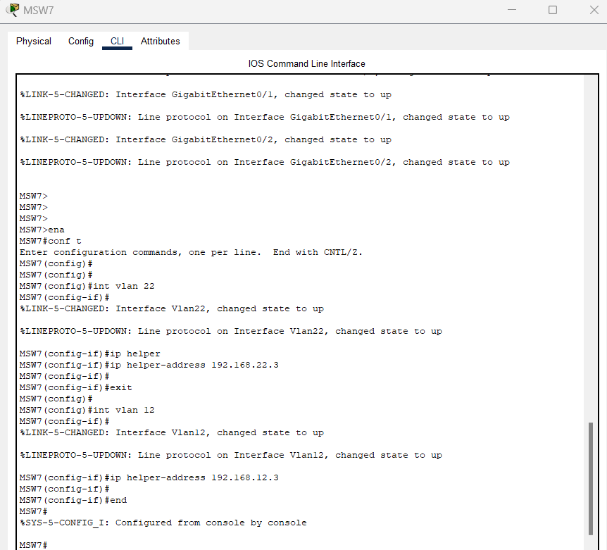
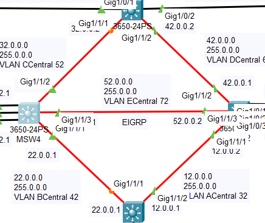
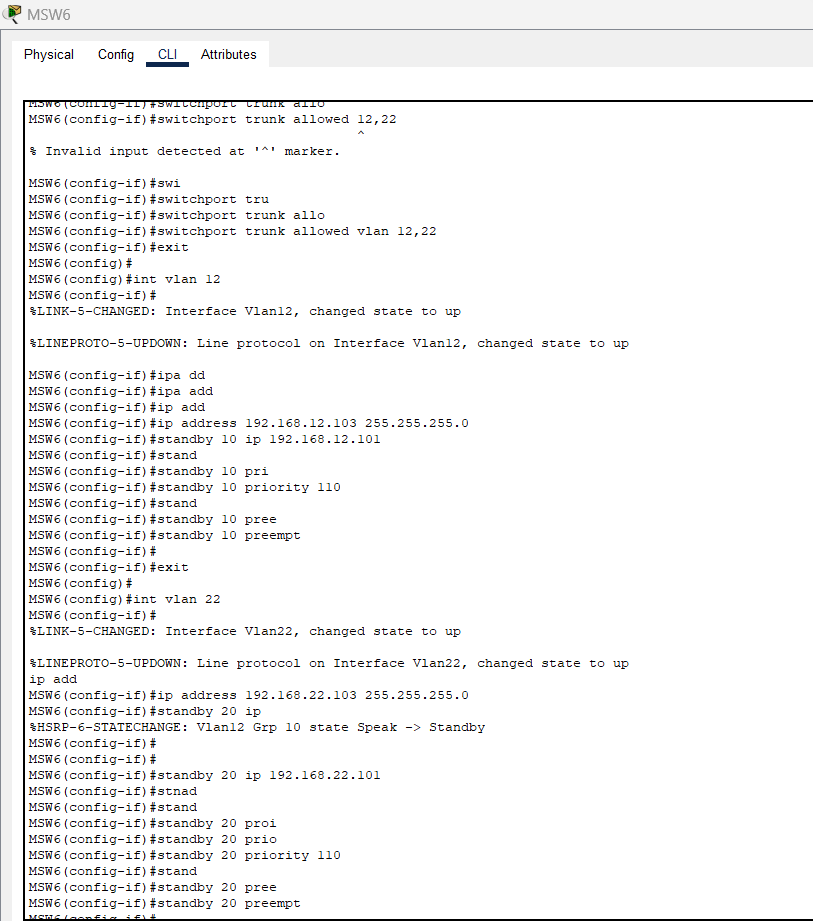
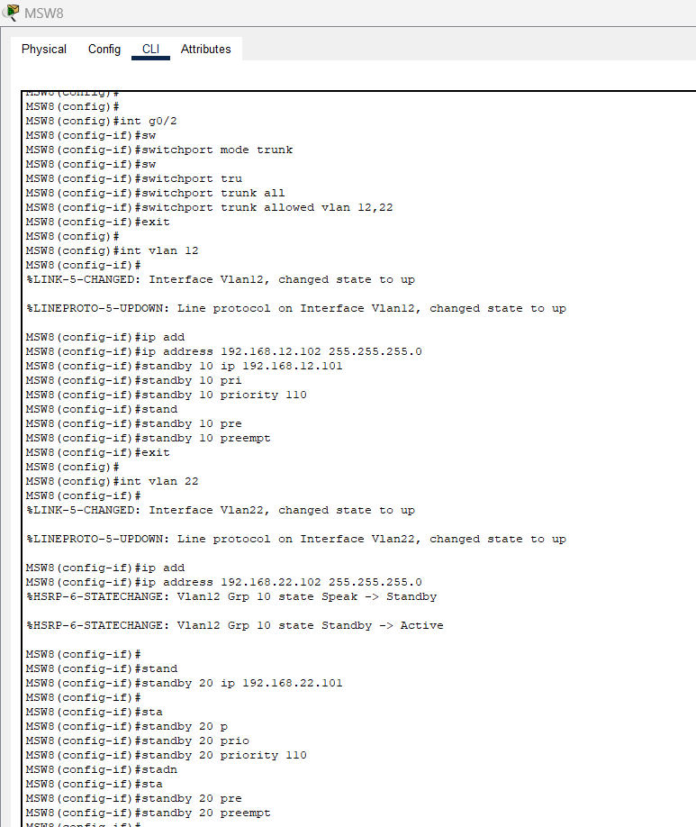
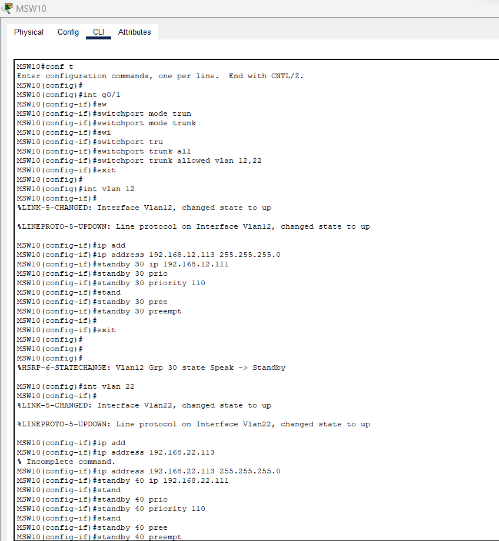
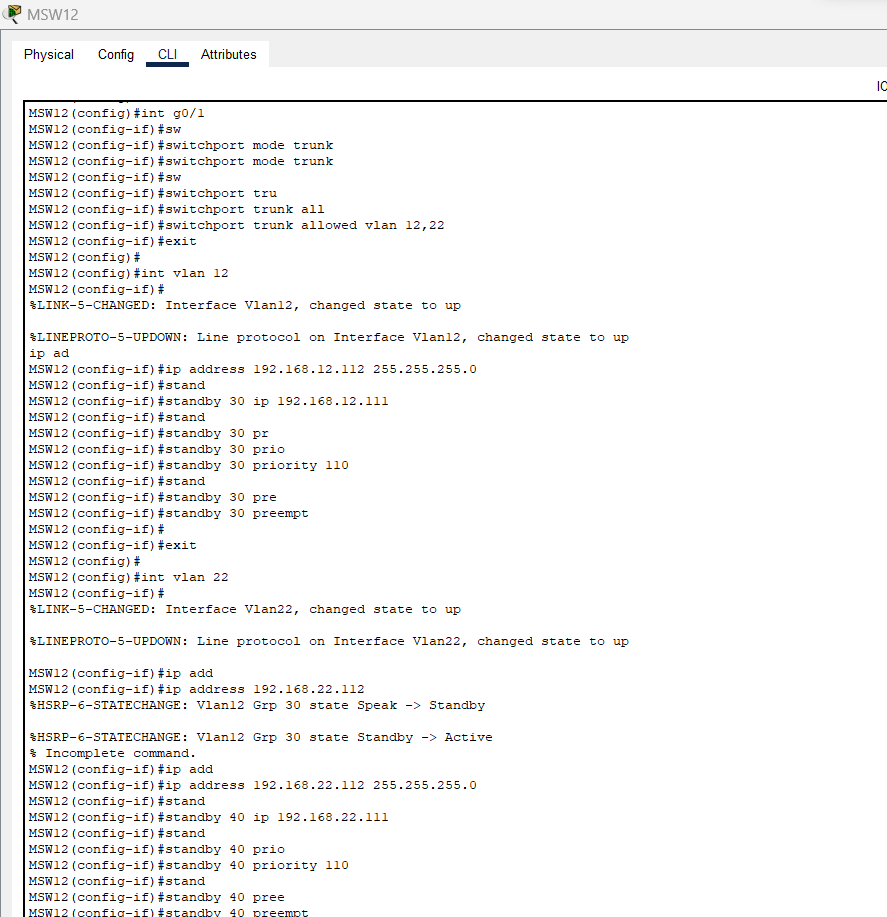
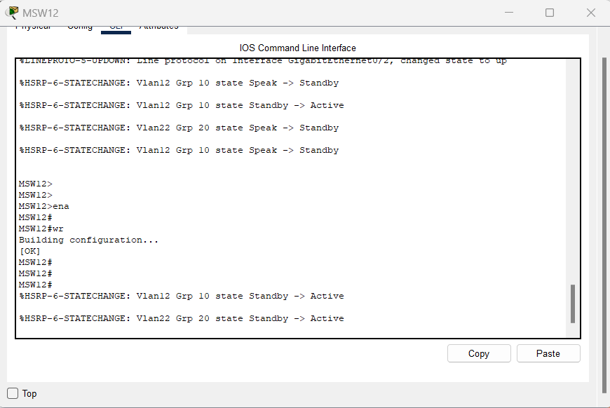

# Manual técnico | Proyecto 1 

## Integrantes Grupo 2

| Carnet    | Nombre                        |
| --------- | ----------------------------- |
| 201800476 | Marvin Alexis Estrada Florian |
| 201902781 | Rodrigo Antonio Porón De León |

## Topología implementada

Se utilizó la herramienta Packet Tracer para la implementación de la topología solicitada, constando de 8 switches 3560, 4 switches 3650 y 4 switches 2960 de capa 2, utilizando 4 PC-PT y 4 Laptop-PT, cada switch configurado con sus respectivos puertos truncales y de acceso como se detallará más adelante:


Para la conexión de switches 3650 con cable de fibra óptica, se realizó la configuración de agregar puertos y un módulo de fuente de poder a los 4 switches centrales de la topología:


## Configuración de Ip

Existen 7 redes dentro de la topología con una ip determinada con la siguientes direcciones en la tabla:

| Dirección    | Máscara de subred |
| ------------ | ----------------- |
| 192.168.12.0 | 255.255.255.0     |
| 192.168.22.0 | 255.255.255.0     |
| 12.0.0.0     | 255.0.0.0         |
| 22.0.0.0     | 255.0.0.0         |
| 32.0.0.0     | 255.0.0.0         |
| 42.0.0.0     | 255.0.0.0         |
| 52.0.0.0     | 255.0.0.0         |

## Configuración de puertos

En este apartado, se realizó la configuración de los puertos de cada switch, a nivel general se configuraron únicamente para los que tienen contacto directo con alguna PC-PT, Laptop-PT, los 2 servidores DHCP y el servidor Web se colocaron en modo acceso, para todos los demás puertos se configuraron en modo trunked para una correcta comunicación entre toda la toología, por lo que a continuación se muestran algunos ejemplos de las configuraciones realizadas:

- MSW2: Configuración de puertos truncal

  

- MSW5: Configuración de puertos truncal

  

- SW1: Configuración de puertos de acceso para los dispositivos finales y truncal

  

- MSW3: Configuración de puertos de acceso para el servidor web y truncal

  

- MSW1: Configuración de puertos de acceso para ambos servidores DHCP y truncal

  

## VTP

Se realizó la configuración del protocolo VTP, donde se determinó que el switch server sería el MSW4, ingresando sus respectivos comandos de la siguiente manera:


Por lo que en consecuencia, se procedió a la configuración de todos los demás switches de la topología, siendo estos los clientes del mismo protocolo como se muestra a continuación:


Dando como credenciales que el dominio sería grupo2 y la contraseña redes2, esto como parte de la libertad proporcionada de colocar las mismas a nuestro criterio.

## VLAN

Iniciando esta configuración se tomó como base las VLAN's solicitadas, como se muestra a continuación en la tabla:

| Nombre      | Número |
| ----------- | ------ |
| Ventas      | 12     |
| Informatica | 22     |
| ACentral    | 32     |
| BCentral    | 42     |
| CCentral    | 52     |
| DCentral    | 62     |
| ECentral    | 72     |

Para realizar esta configuración, se ingresaron las VLAN's respectivamente en el switch MSW4 mencionando anteriormente que este es el server del protocolo VTP, por lo que se muestran los comandos ingresados:


Esta configuración, se aplicó en todos los switches clientes de la topología al aplicarse el protocolo vtp, estas VLAN's fueron trasmitidas a dichos switches.

## InterVLAN Routing

El enrutamiento interVLAN permite que los dispositivos en diferentes VLANs se comuniquen entre sí, lo que es esencial en estas redes para controlar el tráfico y mejorar la seguridad, por lo que se configuró sobre cada uno de los switches capa 3 3650 del centro de la topología de la siguiente manera:

- Configuración sobre MSW4: Se agrega el gateway 192.168.12.1 con máscara de subred 255.255.255.0, el 192.168.22.1 con máscara de subred 255.255.255.0, el 22.0.0.1 con máscara de subred 255.0.0.0, 32.0.0.1 con máscara de subred 255.0.0.0 y 52.0.0.1 con máscara de subred 255.0.0.0, el MSW2 se realizó de forma parecida con sus respectivas red:

  

- Configuración sobre MSW3: Se agrega el gateway 192.168.22.4 con máscara de subred 255.255.255.0 para el servidor web, el 12.0.0.1 con máscara de subred 255.0.0.0, 22.0.0.1 con máscara de subred 255.0.0.0

  

- Configuración sobre MSW1: Se agrega el gateway 192.168.12.3 con máscara de subred 255.255.255.0 para un servidor DHCP, el 192.168.22.3 con máscara de subred 255.255.255.0 para un servidor DHCP, 32.0.0.2 con máscara de subred 255.0.0.0 y 42.0.0.2 con máscara de subred 255.0.0.0

  

## LACP (PortChannel)

Se realizó la configuración del PortChannel, donde es una técnica que se utiliza para combinar múltiples enlaces físicos en un solo enlace lógico de alta velocidad. Esto mejora la capacidad y la redundancia de la conexión entre dos dispositivos, como un switch y un servidor o entre dos switches, por lo que estos 2 ejemplos de comandos mostrados a continuación detalla como configurar el mismo:

- Configuración de un Switch 3650 para la realización del LACP, donde se agregan todas las VLAN's, añadiendo los puertos Gig1/0/1, Gig1/0/2 y Gig1/0/3:

  

- Configuración de un Switch 3560 para la realización del LACP, donde se agregan todas las VLAN's, añadiendo los puertos Fa0/1, Fa0/2 y Fa0/3:

  

## DHCP

Se realizó la configuración del protocolo DHCP en los 2 switches DHCP1 y DHCP2, donde se les ingresó las ip de forma estática, en conjunto con su respectivo gateway, DNS:


Añadiendo la red respectiva de cada VLAN, para poder asignar la ip de forma dinámica en cada servidor de la siguiente manera:


Este procedimiento se realizó en el servidor web para asignarle su ip de forma estática, este perteneciendo a la red 192.168.22.0 con ip 192.168.22.4 respectiva.

## Ip Helper

Se realizó la configuración del comando Ip Helper Address en todos los switches multicapa que tuvieran interfaces VLAN, comando que permite que los dispositivos pertenecientes a una subred puedan solicitar una dirección IP a un servidor DHCP dependiendo de la subred a la que pertenezcan, por lo que se muestra un ejemplo de la configuración realizada:



Estos comandos se ingresaron en todos los switches multicapa que tuvieran interfaces VLAN.

## EIGRP

Se realizó la configuración del protocolo EIGRP en los switches que enrutaban a los 4 edificios.

La configuración fue la siguiente:


Esto se realizó en los siguientes switches:



## HSRP

Se realizó la configuración HSRP para los switches multicapa que enrutaban cada edificio.

La configuración fue la siguiente (para cada edificio):

Los switches configurados para el edificio de la izquierda de la topología fueron: MSW8 y MSW6, los cuales funcionarán como pasivos o activos.

### MSW6



### MSW8



En el edificio de la derecha de la topología se configuraron los switches MSW10 y MSW12, los cuales funcionarán como pasivos o activos.

### MSW10



### MSW12



**_En ambos edificios se realizó la misma configuración para los dos switches mencionados_**

En el edificio de la derecha se realizó la prueba del correcto funcionamiento eliminando uno de los dos switches configurados, el resultado fue el siguiente:



Fuente: [Understand the Hot Standby Router Protocol Features and Functionality](<https://www.cisco.com/c/en/us/support/docs/ip/hot-standby-router-protocol-hsrp/9234-hsrpguidetoc.html#:~:text=The%20HSRP%20behavior%20with%20this,by%2010%20(priority%20becomes%2090)>)

### Servidor Web

Se realizó la configuración del servidor web perteneciente a la red 192.168.22.0, para ello se utilizó el servicio HTTP del mismo, habilitando los protocolos HTTP y HTTPS, seguido a esto se editó el archivo index.html para mostrar la página web estática con la información requerida, el documento html es el siguiente:

```html
<!DOCTYPE html>
<html lang="es">
  <head>
    <meta charset="UTF-8" />
    <title>Información del Grupo 2</title>
    <style>
      body {
        font-family: Arial, sans-serif;
        background-color: #172554;
        text-align: center;
      }

      .container {
        padding: 20px;
        background-color: #ffffff;
        border-radius: 10px;
        box-shadow: 0px 0px 10px rgba(0, 0, 0, 0.2);
        margin: 20px auto;
        max-width: 400px;
      }

      h1 {
        color: #38bdf8;
      }

      h2 {
        color: #555;
      }

      ul {
        list-style: none;
        padding: 0;
      }

      li {
        margin-bottom: 10px;
      }
    </style>
  </head>
  <body>
    <div class="container">
      <h1>Grupo 2</h1>
      <h2>Datos de los Integrantes:</h2>
      <ul>
        <li><strong>Rodrigo Antonio Porón De León</strong> - 201902781</li>
        <li><strong>Marvin Alexis Estrada Florian</strong> - 201800476</li>
      </ul>
    </div>
  </body>
</html>
```

###### _2023 - Laboratorio de Redes de computadoras 2_

---
